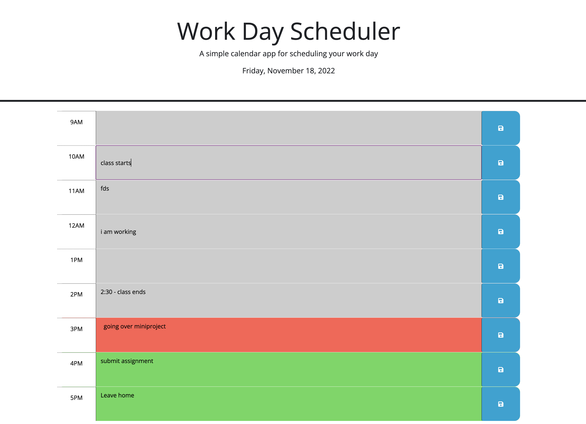

# A Workday Calendar

## Description

This is a responsive and interactive workday calendar that allows users to input notes/events for each working hour of the day. The calendar will save your previous entry, and update accordingly. The time blocks on the calendar also display different colors to indicate whether the time is past, present or future.

## Installation

N/A

## Usage

Link to the calendar: https://wytseng.github.io/workday-calendar/ 

The date in the header of the calendar will automatically update each day to reflect current date.

To enter an event, simply click and type in the time block. To save the event, click the blue button with the save icon to the right of each time block. The event then will be saved and loaded in by default on next page refresh. 

To remove an event, simply clear the time block and hit save again. 

## Credits

N/A

## License

N/A
